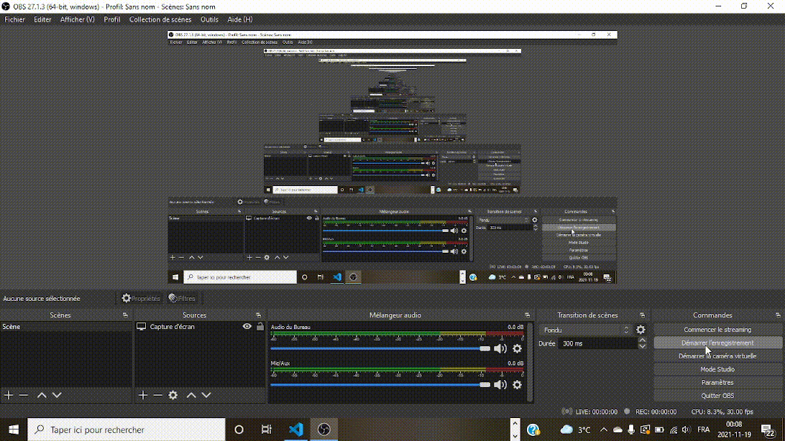
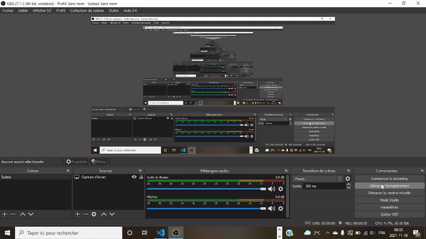
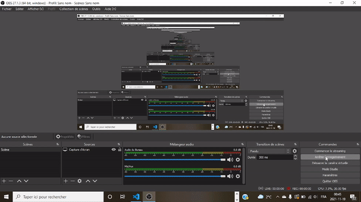
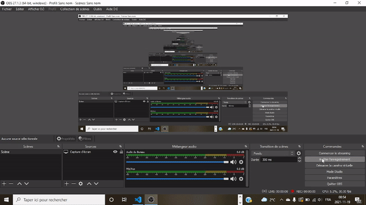

# Comment faire fonctionner un programme?

## Étape 1 : Installer .NET et Visual Studio Code

**Framework**
: Support technologique qui sert à organiser le développement d'un logiciel. Il permet de travailler d'une manière plus simple et d'éviter des erreurs de programmation potentielles.

<ins>**Avantages de Visual Studio Code**</ins>
- Éditeur gratuit
- Multiplateforme
- Peut être utilisé pour programmer en plusieurs langages informatiques

## Étape 2 : Installer des extensions
Visual Studio Code ne vient pas accompagné des outils nécessaires pour programmer, donc il faut aller chercher des extensions.

## Étape 3 : Créer un nouveau dossier et l'ouvrir sur Visual Studio Code

## Étape 4 : Créer un projet à l'intérieur du dossier TIM
**Terminal**
: Une interface qui permet d'entrer des commandes.

**Console**
: Une interface qui permet une communication entre le système et l'utilisateur. L'information transmise par le système est qualifiée de ***output*** et celle que qui est entrée par l'utilisateur est connue sous le terme ***input***.

## Étape 5 : Ajuster les paramètres d'utilisateur 

## Étape 6 : Faire fonctionner le programme

**Déboguer**
: Identification et élimination des erreurs dans un logiciel.

### Merci! 😄

